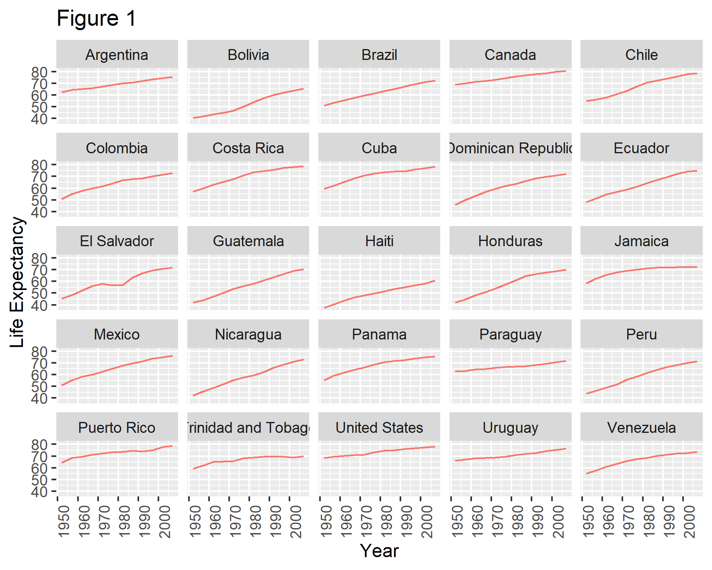

```{r setup, include=FALSE}
knitr::opts_chunk$set(echo = TRUE)
```

## R Markdown

This is an R Markdown *document.* Markdown is a simple formatting syntax for authoring HTML, PDF, and MS Word documents. For more details on using R Markdown see <http://rmarkdown.rstudio.com>.

When you click the **Knit** *knit* button a *document* will be generated that includes both content as well as the output of any embedded R code chunks within the document. You can embed an R code chunk like this:

```{r cars}
summary(cars)
```

## Including Plots

You can also embed plots, for example:

```{r pressure, echo=FALSE}
plot(pressure)
```

Note that the `echo = FALSE` parameter was added to the code chunk to prevent printing of the R code that generated the plot.

## Division de subtitulos

# Genero Plantae (titulo principal)
## Plantas Verdes (sub1)
### Streptophyta (sub2)
#### Plantas terrestres (sub3)
##### Plantas vaculares (sub4)

`codigo`

### Challenge 1

# Titulo Articulo/ tesis
## chapter 1
### Materiales
### Result
## chapter 2

*italica*
**bold**

Nombre de las participantes

* Johana 
* Elisa
* Fer
* Claudia
* Nelly

```{r}
gapminder <- read.csv("./data/gapminder_data.csv", stringsAsFactors = TRUE)
head(gapminder)
```

```{r}
library(ggplot2)

ggplot(data = gapminder, mapping = aes(x=continent, y =lifeExp, fill=continent)) + 
  geom_boxplot() + # graficar boxplot
  facet_wrap(~year) + # dividirlo por year
  theme(axis.title.x = element_blank(), # eliminar el titulo en x
        axis.text.x = element_blank(), # elimiinar la informacion en x
        axis.ticks.x = element_blank())  # eliminar las divisiones
```
El codigo lo obtuve de Claudia en el sitio web de [Carpentry](https://swcarpentry.github.io/r-novice-gapminder/08-plot-ggplot2/index.html).

```{r}
continent_plot <- ggplot(data = gapminder, mapping = aes(x=continent, y =lifeExp, fill=continent)) + 
  geom_boxplot() + # graficar boxplot
  facet_wrap(~year) + # dividirlo por year
  theme(axis.title.x = element_blank(), # eliminar el titulo en x
        axis.text.x = element_blank(), # elimiinar la informacion en x
        axis.ticks.x = element_blank())  # eliminar las divisiones

ggsave(filename = "continent_plot.png",
       plot = continent_plot,
       width = 15,
       height = 12,
       dpi = 300,
       units = "cm")
```


```{r}
head(gapminder)
```


```{r}
ggplot(gapminder, aes(x=continent, y =lifeExp, fill=continent)) +
  geom_boxplot()
```

```{r}
ggplot(gapminder, aes(x=lifeExp, y=continent)) +
  geom_point()
```

```{r, echo=FALSE}
ggplot(data = gapminder, mapping = aes(x=year, y=lifeExp, color=continent)) +
  geom_line()
```

## Agregar una figura

Agregar figuras desde una pagina web


```{r}

```

## Poner codigo en el texto

La suma de 4 mas 5 es `r 4+5`.

La division de 4 entre 5 es `r 4/5`.

La multiplicacion de 4 por 5 es `r 4*5`.

Si 4^5 cuanto es? `r 4^5`

Redondear valores, 9.44 se redondea a `r round(9.44,1)`

## Notitas

COLORED NOTE BOXES
Use one of the following <div> tags to display text in a colored box. The color of the box is determined by the alert type that is specified.

Blue boxes (alert-info)
<div class="alert alert-block alert-info">
<b>Tip:</b> Use blue boxes (alert-info) for tips and notes.</div>

Yellow boxes (alert-warning)
<div class="alert alert-block alert-warning">
<b>Example:</b> Use yellow boxes for examples that are not inside code cells, or use for mathematical formulas if needed. Typically also used to display warning messages.
</div>

Green boxes (alert-success)
<div class="alert alert-block alert-success">
<b>Success:</b> This alert box indicates a successful or positive action.
</div>

Red boxes (alert-danger)
<div class="alert alert-block alert-danger">
<b>Danger:</b> This alert box indicates a dangerous or potentially negative action.
</div>


<div class="alert alert-block alert-info">
<b>Nota:</b> Se feliz hoy y siempre. </div>


## Lenguaje matematico

* Agregar ecuacion matematica

$$y = \mu + \sum_{i=1}^p \beta_i x_i + \epsilon$$

* Agregar subindices para formulas (F~2~)

* Agregar super indice (F^2^)

## Hacer tablas

<table class="table table-hover">
  <thead>
    <tr>
      <th scope="col"><center>Experimentos</center></th>
      <th scope="col"><center>No. de Transcriptomas</center></th>
    </tr>
  </thead>
  <tbody>
  </tr>
    <tr class="table-light">
      <th scope="row">Etapas de desarrollo de la silicua</th>
      <td><center>4</center></td>
  </tr>
  </tr>
    <tr class="table-light">
      <th scope="row">Raíz, flor, fruto y hoja</th>
      <td><center>4</center></td>
  </tr>
  </tbody>
</table>

