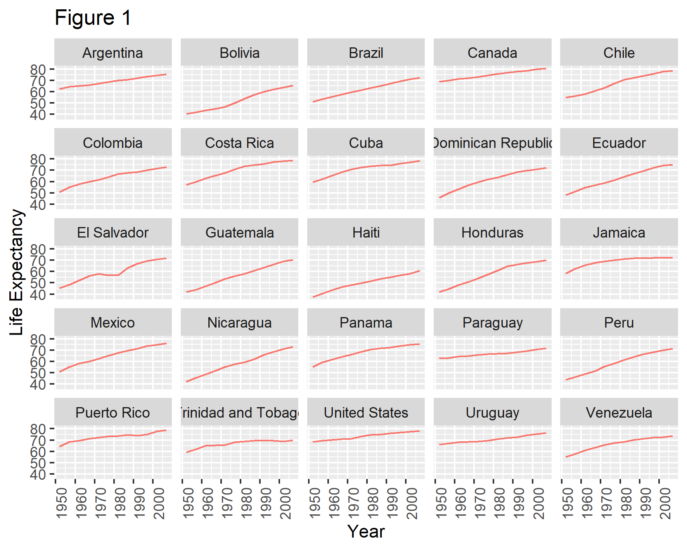

# Introduccion a Rmarkdown

Autora: Evelia Coss
-----------------------

En este apartado estaremos siguiendo el material de Carpentry, capitulo 15 [Producing Reports With knitr](https://swcarpentry.github.io/r-novice-gapminder/15-knitr-markdown/index.html).
Ademas aprenderemos a crear indices en nuestros reportes y agregar notas de ayuda de diferentes colores.

## Instalacion de Rmarkdown en Rstudio

En la linea de comandos colocar el siguiente codigo:
```
install.packages("rmarkdown")
```

## Archivo inicial

Para crear un archivo dar click en `File/New file/R markdown`. El archivo generado tiene en la parte superior las siguientes instrucciones:

```
---
title: "Sesion de Rmarkdown"
author: "Evelia Coss"
date: "4/9/2022"
output: html_document 
---
```

En donde se indica el nombre del archivo que le dimos al crearlo, el nombre del autor, la fecha y el tipo de archivo de salida. En este caso es un archivo tipo html.

Ademas, se incluyen una serie de instrucciones entre la linea de comandos para obtener el resumen (summary) de la variable cars. Las instrucciones pueden contener un titulo, en este caso "cars".

```{r cars}
summary(cars)
```

## Division de titulos

Los titulos se dividen por el simbolo `#`, de la siguiente manera:

```
# Genero Plantae (titulo principal)
## Plantas Verdes (sub1)
### Streptophyta (sub2)
#### Plantas terrestres (sub3)
##### Plantas vaculares (sub4)
```

## Letras negritas e italicas

Puedes resaltar tu informacion colocando el simbolo `*` antes y despues del texto: Ejemplo: *italica* y **negritas**.

```
*italica*
**negritas**
```

Ademas tambien podemos usar este mismo simbolo para comodar la informacion (vinetas):

```
Nombre de las participantes

* Johana 
* Elisa
* Fer
* Claudia
* Nelly
```

Nombre de las participantes

* Johana 
* Elisa
* Fer
* Claudia
* Nelly

## Visualizacion grafica

Rmarkdown es ideal para crear reportes con codigo, notas y graficas.

Tomando el ejemplo del [capitulo 8](https://swcarpentry.github.io/r-novice-gapminder/08-plot-ggplot2/index.html).

Primero cargamos nuestros datos en el entorno de RStudio.
```{r}
gapminder <- read.csv("./data/gapminder_data.csv", stringsAsFactors = TRUE)
head(gapminder)
```

Cargamos el paquete `ggplot2` y graficamos la informacion en forma de boxplot.

```{r}
library(ggplot2)

continent_plot <-  ggplot(data = gapminder, mapping = aes(x=continent, y =lifeExp, fill=continent)) + 
  geom_boxplot() + # graficar boxplot
  facet_wrap(~year) + # dividirlo por year
  theme(axis.title.x = element_blank(), # eliminar el titulo en x
        axis.text.x = element_blank(), # elimiinar la informacion en x
        axis.ticks.x = element_blank())  # eliminar las divisiones
        
continent_plot
```

Nota: para mas ejemplos de graficas puedes abrir el archivo **Ejemplo_Rmarkdown_090422.Rmd**.

## Agregar imagenes

Podemos anexar imagenes a nuestros archivos tomando figuras de internet como el siguiente ejemplo.

```

```


Ademas, podemos anexar archivos contenidos en nuestra computadora:

```{r}

```

## Realizar calculos en el texto

Podemos senalar en el texto que parte del mismo es un calculo matematico mediante el simbolo de comilla invertida (` `) en ambos extremos. Obteniendo algunos ejemplos como los siguientes.

La suma de 4 mas 5 es `r 4+5`.

La division de 4 entre 5 es `r 4/5`.

La multiplicacion de 4 por 5 es `r 4*5`.

Si 4^5 cuanto es? `r 4^5`

Redondear valores, 9.44 se redondea a `r round(9.44,1)`

## Lenguaje matematico

* Agregar ecuacion matematica

$$y = \mu + \sum_{i=1}^p \beta_i x_i + \epsilon$$

* Agregar subindices para formulas (F~2~)

* Agregar super indice (F^2^)

## Generar tablas

Rmarkdown puede emplear el lengua `html` para dar formato a la informacion.

<table class="table table-hover">
  <thead>
    <tr>
      <th scope="col"><center>Experimentos</center></th>
      <th scope="col"><center>No. de Transcriptomas</center></th>
    </tr>
  </thead>
  <tbody>
  </tr>
    <tr class="table-light">
      <th scope="row">Etapas de desarrollo de la silicua</th>
      <td><center>4</center></td>
  </tr>
  </tr>
    <tr class="table-light">
      <th scope="row">Raíz, flor, fruto y hoja</th>
      <td><center>4</center></td>
  </tr>
  </tbody>
</table>

## Notitas

Para dar color a tus reportes puede agregar notas en los mismos dependiendo del contenido de la informacion:

Blue boxes (alert-info)
<div class="alert alert-block alert-info">
<b>Tip:</b> Use blue boxes (alert-info) for tips and notes.</div>

Yellow boxes (alert-warning)
<div class="alert alert-block alert-warning">
<b>Example:</b> Use yellow boxes for examples that are not inside code cells, or use for mathematical formulas if needed. Typically also used to display warning messages.
</div>

Green boxes (alert-success)
<div class="alert alert-block alert-success">
<b>Success:</b> This alert box indicates a successful or positive action.
</div>

Red boxes (alert-danger)
<div class="alert alert-block alert-danger">
<b>Danger:</b> This alert box indicates a dangerous or potentially negative action.
</div>
  
## Agregar indice

Para finalizar podemos agregarle un indice a nuestro reporte editando la parte superior.

 * Informacion incial
```
---
title: "Sesion de Rmarkdown"
author: "Evelia Coss"
date: "4/9/2022"
output: html_document 
---
```

* Informacion modificada para agregar el indice

```
title: "Sesion de Rmarkdown"
author: "Evelia Coss"
date: "4/9/2022"
output: 
  html_document:
    toc: yes
    toc_float: yes
    toc_depth: 6
    theme: cerulean
```

`toc` es para indicar que vas a agregar un indice en el reporte, `toc_float` es para indicar si el indice va a ser flotante o no, si indicas `yes` el indice se localizara a la izquiera de la pantalla y la informacion se desplegara cuando se coloques sobre ella. `toc_depth` es para indicar el numero de subtitulos que puedes tener en el archivo y `theme` es la decoracion del archivo.

Para mas temas puedes entrar al siguiente link: https://www.datadreaming.org/post/r-markdown-theme-gallery/


